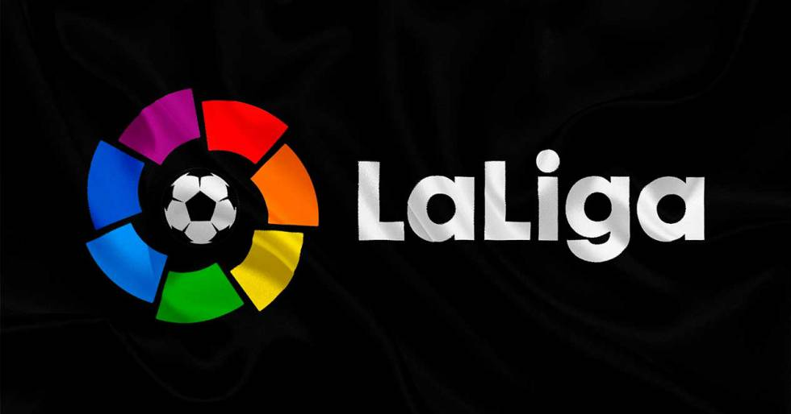

# Proyecto La Liga Web

La Liga Web es una página donde puedes encontrar un abanico de información sobre la liga 2020-2021.

Puedes acceder a la web a través de este enlace ()

## Descripción funcional
***

Mediante La Liga Web el usuario tiene acceso a toda la información relativa a los partidos de la temportada, las clasificaciones, estadisticas sobre los 5 equipos con mayor average y los 5 equipos con menos goles en contra como visitante.
También se puede encontrar un filtro de búsqueda de equipo por partidos ganados, empatados, perdidos o próximos.

## Casos de uso
***
()

## Descripción técnica
***
()

## Tecnologías
***
* HTML5
* CSS3
* Boostrap
* JavaScript

## Versiones
***
V 1.0 - Proyecto presentado.

## TO DO
***
Mejorar responsive
Mejorar diseño
Añadir footer
Imagenes equipos
